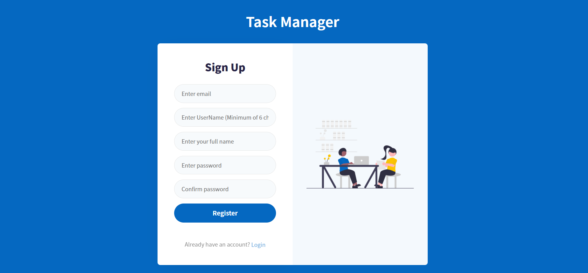
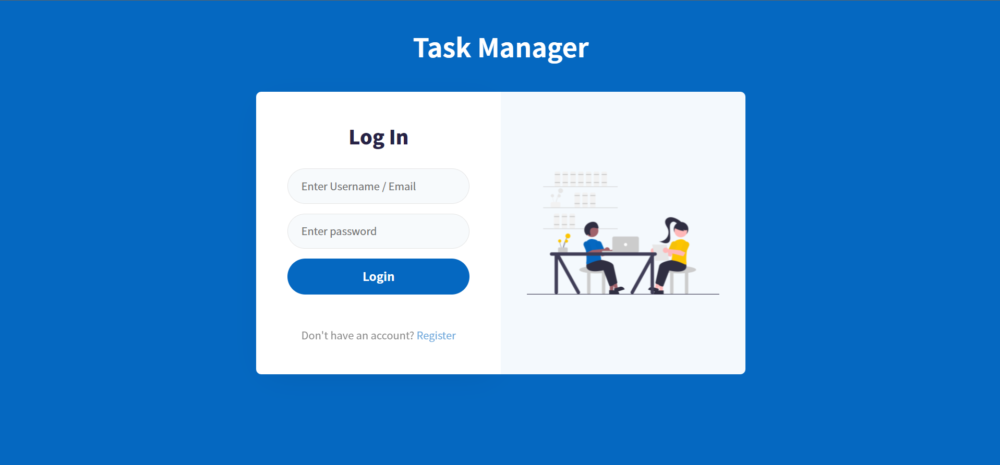
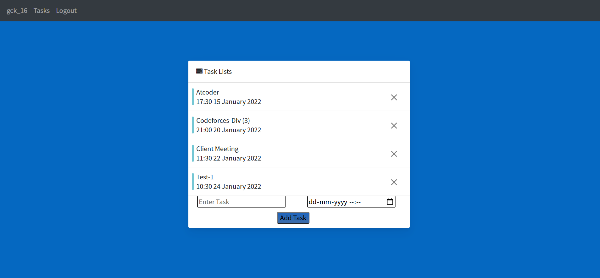
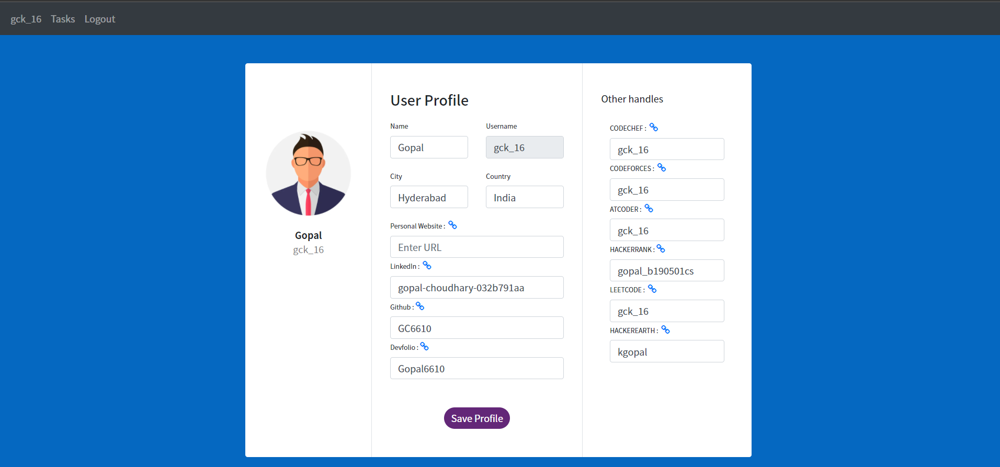

# The-College-App
User can create their account on this portal 
and can use features like
1. track their day to day tasks 
2. Maintain Coding/Social Profiles
3. Create post in categories like Buy/Sell/LostandFound/Others

## Setting up the Server
- Should have Flask installed
- If not install using the command `py -3 -m pip insall flask`
- Go to the main project directory
- Start the server using `py main.py` and server will start at http://127.0.0.1:5000/

## Techstack Used
 
Backend : Flask 
Frontend : Bootstrap 
 

 

